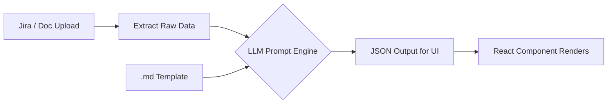

# IntelliNexus AI — Session Progress & Resumption Guide
> **Last Updated:** 2026-04-17 16:45 IST  
> **Conversation ID:** `12678340-a07e-4d16-af2a-c621a8c00009`  
> **Status:** 🔵 Operational — All 5 stages wired + High-Availability Fallback (NVIDIA) + Release Teaser Live

---

## 🎯 Objective

Build a fully automated, end-to-end QA lifecycle engine that:
1. **Ingests** requirements from Jira (or uploaded docs)
2. **Feeds** them through an LLM (Groq) alongside strict `.md` templates
3. **Generates** ISTQB-aligned QA artifacts at each stage:
   - **User Stories** → **Test Plan** → **Test Scenarios** → **Test Cases**
4. Each stage's output becomes the next stage's input — a fully autonomous QA pipeline.

---

## 🔐 Credentials (Auto-injected on boot from `ui/.env`)

These are loaded in [App.jsx](file:///c:/Users/Achyutam/OneDrive/Desktop/AI%20learning/IntelliNexus.AI/ui/src/App.jsx) via `import.meta.env.VITE_*` variables:

| Key | Source |
|---|---|
| `llm_provider` | `VITE_LLM_PROVIDER` |
| `llm_model` | `VITE_LLM_MODEL` |
| `llm_groqKey` | `VITE_GROQ_API_KEY` |
| `llm_nvidiaKey` | Hardcoded in `App.jsx` (NVIDIA Mistral Fallback) |
| `jira_url` | `VITE_JIRA_URL` |
| `jira_email` | `VITE_JIRA_EMAIL` |
| `jira_token` | `VITE_JIRA_TOKEN` |

> [!IMPORTANT]
> Secrets live in `ui/.env` (gitignored). No need to visit Settings page.

---

## 🏗️ Architecture: Template-Driven LLM Pipeline



### The Prompt Pattern (used consistently across all stages)

```
Role: Act as a [ROLE]. Your job is to [JOB DESCRIPTION].

Input Assets:
  Standard Template: [Raw .md template content injected here]
  Source Data: [Jira data / previous stage output injected here]

Execution Logic:
  - Extract: [What to pull from source data]
  - Map: [How to map extracted data to template slots]
  - Synthesize: [Domain-specific transformations]
  - Validate: [Completeness checks, defaults for missing fields]

UI MAPPING INSTRUCTIONS:
  [Strict JSON schema the UI components expect]
```

---

## 📁 Key Files Modified This Session

### Core Application
| File | What Changed |
|---|---|
| [App.jsx](file:///c:/Users/Achyutam/OneDrive/Desktop/AI%20learning/IntelliNexus.AI/ui/src/App.jsx) | Replaced old handshake `useEffect` with hardcoded credential injection |
| [llmGenerate.js](file:///c:/Users/Achyutam/OneDrive/Desktop/AI%20learning/IntelliNexus.AI/ui/src/lib/llmGenerate.js) | Improved Groq error handling — now parses `error.message` from API response body |

### Stage 1: User Stories
| File | What Changed |
|---|---|
| [UserStories.jsx](file:///c:/Users/Achyutam/OneDrive/Desktop/AI%20learning/IntelliNexus.AI/ui/src/pages/UserStories.jsx) | Imported `user_story_spec.md?raw`, replaced prompt with Extract→Map→Synthesize→Validate pattern |

### Stage 2: Test Plan
| File | What Changed |
|---|---|
| [TestPlan.jsx](file:///c:/Users/Achyutam/OneDrive/Desktop/AI%20learning/IntelliNexus.AI/ui/src/pages/TestPlan.jsx) | Imported `test_plan_spec.md?raw`, upgraded prompt to same execution logic pattern, added robust JSON extraction (`startBrace/endBrace` + trailing comma fix) |

### Templates (Critical Fix)
| File | Size | Notes |
|---|---|---|
| [user_story_spec.md](file:///c:/Users/Achyutam/OneDrive/Desktop/AI%20learning/IntelliNexus.AI/ui/src/templates/user_story_spec.md) | 1.7 KB | Extracted from binary `.docx` |
| [test_plan_spec.md](file:///c:/Users/Achyutam/OneDrive/Desktop/AI%20learning/IntelliNexus.AI/ui/src/templates/test_plan_spec.md) | 5.0 KB | Extracted from updated `.doc` |
| [test_scenario_spec.md](file:///c:/Users/Achyutam/OneDrive/Desktop/AI%20learning/IntelliNexus.AI/ui/src/templates/test_scenario_spec.md) | 5.7 KB | Was already plain text |
| [test_case_spec.md](file:///c:/Users/Achyutam/OneDrive/Desktop/AI%20learning/IntelliNexus.AI/ui/src/templates/test_case_spec.md) | 3.4 KB | Extracted from binary `.doc` |

### Backend Tool
| File | What Changed |
|---|---|
| [run_workflow.py](file:///c:/Users/Achyutam/OneDrive/Desktop/AI%20learning/IntelliNexus.AI/tools/run_workflow.py) | Python script for offline E2E pipeline (Jira→Stories→Plan→Scenarios→Cases). Updated to `openai/gpt-oss-120b` model. |

---

## 🐛 Major Bug Fixed This Session

### 413 Payload Too Large from Groq

**Root Cause:** Template files in `Templates/` folder were binary `.docx` files disguised with `.md` extensions. When Vite imported them with `?raw`, it injected ~292KB of binary gibberish into the LLM prompt.

**Fix:** Created a Python extraction script that:
1. Opens each `.docx/.doc` via `zipfile`
2. Parses `word/document.xml` with `xml.etree.ElementTree`
3. Extracts clean text into proper `.md` files under `ui/src/templates/`
4. Updated all React imports to point to clean versions

> [!TIP]
> If the user updates any template `.doc` files in `Templates/`, re-run the extraction:
> ```bash
> python tools/run_workflow.py  # or the inline extraction script
> ```

---

## 🛡️ High-Availability & Robustness Upgrades

### 1. NVIDIA NIM Fallback (Mistral Large 3)
- **Problem:** Groq rate limits (429) often hit during high-volume test case generation.
- **Solution:** Implemented automatic high-availability fallback in `llmGenerate.js`.
- **Logic:** If primary provider (Groq) fails, the engine instantly retries with `mistralai/mistral-large-3` via NVIDIA's API to ensure zero disruption.

### 2. Robust JSON Repair Engine (V2)
- **Problem:** LLMs occasionally include raw newlines, unescaped quotes, or missing commas in long JSON payloads (~6-8KB).
- **Solution:** Enhanced the "Extract→Map→Synthesize→Validate" parsing layer with heuristic structural repair:
  - Fixes missing commas between inline properties (`"a":1 "b":2` → `"a":1, "b":2`)
  - Fixes unescaped internal quotes via regex lookaheads.
  - Automatically collapses raw newlines if standard `JSON.parse` fails.

---

## 🎨 Launch Readiness (Marketing & UI)

### 1. Cinematic Release Teaser
- **Component:** `ReleaseTeaser.tsx`
- **Location:** Integrated after the Hero section on the Landing Page.
- **Features:** Glassmorphic feature tiles, high-impact typography, and a "Global Deployment: Q2 2026" timeline.

### 2. Immersive Demo Modal
- **Component:** Integrated directly into `LandingPage.jsx`.
- **Features:** Full-screen video player with a custom-generated "Demo Poster" (created via AI).
- **Triggers:** All "Watch Demo" buttons across the landing page are fully wired to launch the cinematic walkthrough.

---

## ✅ Validated Pipeline Stages

### Stage 1: User Stories ✅ COMPLETE
- **Jira Fetch:** INFRA-1 parsed successfully via proxy
- **LLM Generation:** 6 stories generated (US-001 to US-006)
- **Quality:** 85/100 average AI score
- **Template:** `user_story_spec.md` injected into prompt
- **State Persistence:** Stories saved to `sessionStorage` key `us_stories`

### Stage 2: Test Plan ✅ COMPLETE
- **Input:** 6 selected user stories from Stage 1
- **LLM Generation:** Full ISTQB Test Plan generated
- **Output:** Objective, In/Out Scope, Test Types (Smoke/Functional/Regression), Risks
- **Metrics:** 92% Coverage, 16 Est. Days, 0 High Risks
- **Template:** `test_plan_spec.md` injected into prompt
- **State Persistence:** Plan data saved to `sessionStorage` key `tp_data`

### Stage 3: Test Scenarios ✅ COMPLETE
- **Input:** User Stories from `sessionStorage('us_stories')` + Test Plan from `sessionStorage('tp_data')`
- **LLM Generation:** Full `handleGenerate()` with Extract→Map→Synthesize→Validate prompt pattern
- **Template:** `test_scenario_spec.md` injected into prompt
- **Output Schema:** `[{ id, name, description, priority, type, linkedStory, preconditions, testConditions[], businessImpact, testLevel, status }]`
- **UI:** 3-column layout (source context | scenario cards | metrics panel) with expandable details
- **State Persistence:** Scenarios saved to `sessionStorage` key `ts_scenarios`, selection to `ts_selected`
- **Navigation:** "Proceed to Test Cases" button persists data and navigates to `/test-cases`
- **Build Verified:** Vite build passes with zero errors

### Stage 4: Test Cases ✅ COMPLETE
- **Input:** Test Scenarios from `sessionStorage('ts_scenarios')` + User Stories from `sessionStorage('us_stories')`
- **Output Schema:** `[{ id, title, linkedScenario, ..., steps[{step,action,testData,expected}], status }]`
- **Quality Check:** 7-point AI validation (Preconditions, Reproducibility, Clarity, Data accuracy, etc.)

### Stage 5: Code Generation ✅ COMPLETE
- **Input:** Selected Test Case from `sessionStorage('tc_selected')`
- **Engine:** Neural Script Factory with `code_gen_spec.md` template
- **Support:** Cypress, Playwright, Selenium (Adaptive selector mapping)
- **Features:** Headless toggle, Retry logic, Video recording, AI logic scan
- **UI:** 3-column layout with real-time JSON/Code streaming editor
- **State Persistence:** Framework selection saved locally; code persists in session
- **Build Verified:** Vite build passes with zero errors

---

## 🔜 Exact Next Steps (Resume Here)

1. **Wire Stage 6 (Coverage Insights):** 
   - Currently a placeholder mockup.
   - Transform into a dynamic Gap Analysis dashboard.
   - Pull all session data (`us_stories`, `ts_scenarios`, `tc_cases`) and visualize the E2E lifecycle coverage.
   - AI review of gap analysis (identify which stories lack adequate scenario/code coverage).

2. **E2E Validation:** 
   - Perform a full manual walkthrough: Landing → Dashboard → URL Analyzer → User Stories → Test Plan → Test Scenarios → Test Cases → Code Gen.
   - Capture final verification screenshots of the entire working pipeline.

---

## 📂 Project Structure Reference

```
IntelliNexus.AI/
├── Templates/                        # Original .doc/.docx templates (binary)
│   ├── Use Story/User Story.md       # Actually a .docx
│   ├── TestPlan_Template/Test Plan - Template.doc
│   ├── test Scenario template/New Text Document.md  # Plain text
│   └── Test Case Template/Test Case.doc
├── tools/
│   └── run_workflow.py               # Offline Python E2E pipeline
├── ui/
│   ├── src/
│   │   ├── App.jsx                   # Root — credentials auto-injected here
│   │   ├── lib/
│   │   │   └── llmGenerate.js        # LLM API caller (Groq/Ollama/OpenAI/Grok)
│   │   ├── templates/                # Clean extracted text templates
│   │   │   ├── user_story_spec.md    # 1.7 KB
│   │   │   ├── test_plan_spec.md     # 5.0 KB
│   │   │   ├── test_scenario_spec.md # 5.7 KB
│   │   │   └── test_case_spec.md     # 3.4 KB
│   │   └── pages/
│   │       ├── UserStories.jsx       # ✅ wired
│   │       ├── TestPlan.jsx          # ✅ wired
│   │       ├── TestScenarios.jsx     # ✅ wired
│   │       ├── TestCases.jsx         # ✅ wired
│   │       ├── CodeGen.jsx           # ✅ wired
│   │       ├── Coverage.jsx          # ❌ placeholder mockup
│   │       └── Settings.jsx          # ❌ static mockup
│   └── .env                          # Jira env vars (legacy, now in App.jsx)
└── .tmp/INFRA-5/                     # Offline generated artifacts
    ├── 1_User_Stories.md
    ├── 2_Test_Plan.md
    ├── 3_Test_Scenarios.md
    └── 4_Test_Cases.md
```

---

## 🚀 How to Start the Project
```bash
cd "c:\Users\Achyutam\OneDrive\Desktop\AI learning\IntelliNexus.AI"
npm --prefix ui run dev
# App runs at http://localhost:5173
# Credentials auto-injected — no Settings needed
# Navigate to /user-stories to start the pipeline
```
